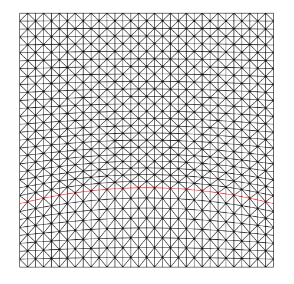
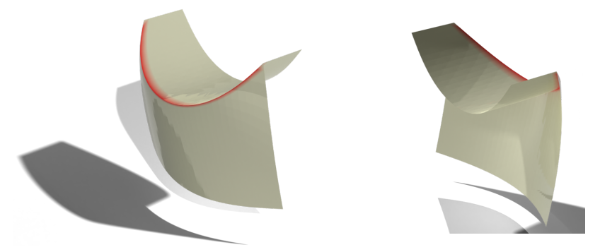

# Optimization of Folds and Developability on Discrete Plates

[](https://opensource.org/licenses/MIT)
[](https://en.cppreference.com/w/cpp/17)
[](https://www.ins.uni-bonn.de/)

This repository contains the implementation of a specialized **Sequential Quadratic Programming (SQP) solver** for optimizing folds and developability on discrete plates. The project was developed as part of a Master's thesis in Mathematics at the **University of Bonn**.

---

## 📖 Project Overview

This project extends the [GOAST (The Geometric Optimization and Simulation Toolbox)](https://gitlab.com/numod/goast) library to address complex geometric optimization problems.

The main objectives are:

* **Fold Optimization**
  Automatically place and refine folds in thin plates and shells to calculate geometries as minimizers of elastic energies.

* **Developable Surfaces**
  Automatically generate meshes that are "developable", i.e. can be flattened into a plane without stretching or tearing,
  under chosen boundary conditions.

* **Custom SQP Solver**
  A tailored Sequential Quadratic Programming implementation designed for high-dimensional nonlinear constraints arising in discrete differential geometry.

---

## 🛠 Features

* **Custom SQP Implementation**
  Designed specifically for energy functionals in discrete plate theory.

* **Constraint Handling**
  Efficient treatment of isometry and developability constraints.

* **GOAST Integration**
  Built on top of the GOAST framework for geodesic computations and manifold optimization.

---

## 🖼 Gallery

|  Initial Mesh  (Folds marked red)  |   Optimal Folding Pattern      |
| :--------------------------------: | :----------------------------: |
|  |  |

---

## ⚙️ Installation & Build

### Prerequisites

* C++17 compatible compiler (GCC, Clang, or MSVC)
* [CMake](https://cmake.org/) (>= 3.14)
* [Eigen3](https://eigen.tuxfamily.org/)

### Build Instructions

```bash
git clone https://gitlab.com/numod/goast.git
cd goast

mkdir build && cd build
cmake ..
make -j$(nproc)
```

---

## 🚀 Quick Start

Run a fold optimization experiment using the SQP solver:

```bash
./bin/fold_optimizer --config configs/your_experiment.json
```

---

## 📂 Project Structure

```
├── src/                # Core implementation
├── configs/            # Experiment configurations
├── docs/               # Images and visualization output
├── bin/                # Compiled executables
└── CMakeLists.txt
```

---

## 📊 Output & Visualization

The solver can export intermediate and final states for visualization. Recommended tools:

* ParaView
* Polyscope
* Blender

---

## 📜 License

This project is licensed under the MIT License.

---

## 🙌 Acknowledgements

* GOAST library contributors
* Institute for Numerical Simulation, University of Bonn
